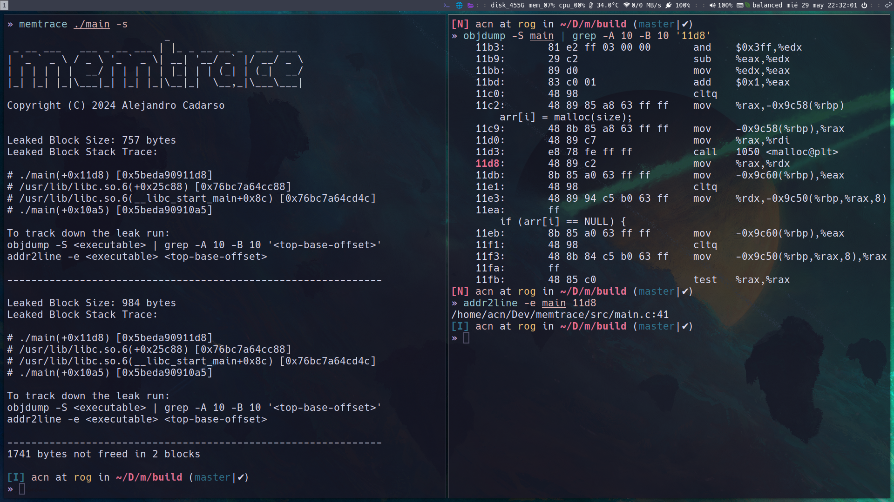

# Memtrace - A Simple Memory Profiling Tool for Linux x86-64

## Overview

**Memtrace** is an educational project aimed at providing a simple yet effective way to monitor and trace memory allocations and deallocations on Linux x86-64 platforms. It employs runtime interposition techniques to override the standard C library's dynamic memory functions (`malloc`, `calloc`, `realloc`, `free`), offering insights into memory usage patterns and potential leaks. However, it is primarily focused on single-threaded applications due to its current implementation limitations.

### Key Features

- **Minimal Overhead**: Designed for minimal performance impact, ideal for development and debugging of simple programs.
- **Interception of Standard C Library Functions**: Accurate tracking of memory operations through standard C library functions.

## Limitations

- **Scope Limited to Standard C Library**: Only tracks standard C library's memory management functions; custom allocators and syscalls are not monitored.
- **Single-Threaded Focus**: Supports single-threaded applications; testing shows potential for false leaks in multi-threaded scenarios. `pthread` internal allocation mechanisms use functionality outside of lib C.
- **Excludes Statically Linked Executables**: Does not affect statically linked executables or application-provided functions.

## Getting Started

To use **Memtrace**, follow these steps:

1. Clone the repository using `git clone https://www.github.com/cdrso/memtrace`.
2. Install Memtrace by running `sudo make install`.
3. Run `memtrace <executable>`

For professional-grade memory profiling, consider using tools like Valgrind. This software was intended merely as a learning experience.

## License

**Memtrace** is licensed under the GNU General Public License v3.0 (GPLv3). See the LICENSE file for details.

